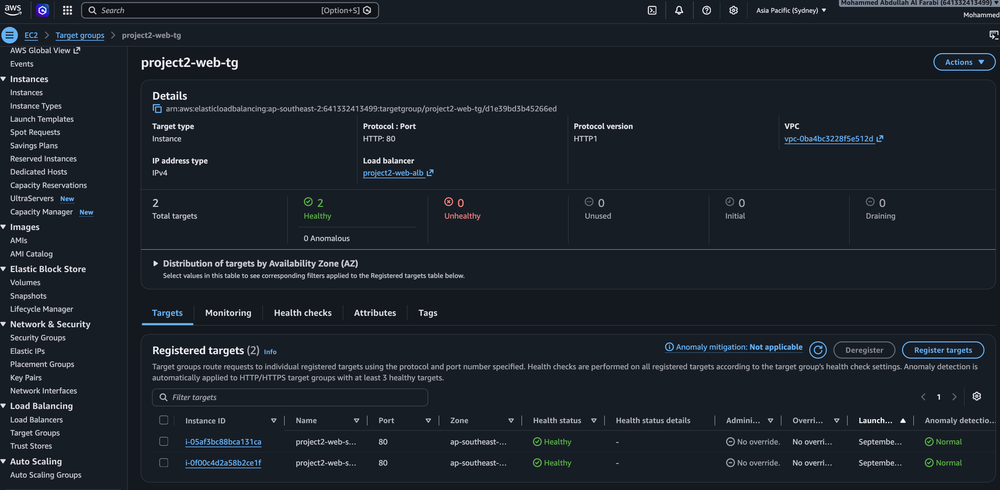

# Terraform AWS High Availability Platform

A highly available and scalable web infrastructure built on **AWS using Terraform**, with automated deployment through a **GitHub Actions CI/CD pipeline**.

This project demonstrates Infrastructure as Code (IaC), AWS networking, load balancing, Auto Scaling, monitoring, alerting, secure OIDC authentication, CI/CD automation, and infrastructure troubleshooting.

---

## 1. Project Overview

This project provisions a highly available web platform on AWS using Terraform.

The infrastructure is deployed across **two Availability Zones** and uses an **Application Load Balancer (ALB)** to distribute HTTP traffic between Apache web servers running on EC2 instances.

The EC2 instances are managed by an **Auto Scaling Group (ASG)** to maintain availability and automatically adjust capacity based on CPU utilization. **Amazon CloudWatch** provides monitoring, while **Amazon SNS** sends email notifications for configured alarms.

The entire infrastructure is managed as code using Terraform. Changes are stored in GitHub and deployed through a **GitHub Actions CI/CD pipeline**, using **OIDC and AWS IAM** for secure authentication without storing long-term AWS access keys.

---

## 2. Architecture


The architecture is designed across two Availability Zones to improve availability and fault tolerance.

---

## 3. Architecture Flow

### Application Request Flow

When a user accesses the application, the HTTP request follows this path:

```text
User
  ↓
Internet
  ↓
Internet Gateway
  ↓
Application Load Balancer (HTTP :80)
  ↓
Target Group
  ↓
Healthy EC2 Instance
  ↓
Apache Web Server
```

The **Application Load Balancer** receives HTTP traffic on port 80 and forwards the request through the **Target Group** to a healthy EC2 instance.

Apache running on the EC2 instance processes the request and serves the web page.

### Application Response Flow

The response travels back to the user:

```text
EC2 / Apache
     ↓
Application Load Balancer
     ↓
Internet Gateway
     ↓
Internet
     ↓
User
```

### Infrastructure Deployment Flow

Infrastructure changes follow this process:

```text
Terraform Code
      ↓
GitHub Repository
      ↓
GitHub Actions
      ↓
CI Checks
      ↓
OIDC Authentication
      ↓
AWS IAM Role
      ↓
Temporary AWS Credentials
      ↓
terraform plan
      ↓
terraform apply
      ↓
AWS Infrastructure
```

Terraform defines the desired AWS infrastructure.

After changes are pushed to GitHub, **GitHub Actions** runs the CI/CD workflow. GitHub Actions uses **OIDC** to authenticate with AWS and assume an IAM role.

Terraform then runs plan and apply to create or update the AWS infrastructure.

---

## 4. Technologies Used

| Technology | Purpose |
|---|---|
| AWS | Cloud platform |
| Terraform | Infrastructure as Code |
| Amazon VPC | Network environment |
| Public Subnets | Multi-AZ infrastructure |
| Internet Gateway | Internet connectivity |
| Route Table | Network routing |
| Application Load Balancer | Traffic distribution |
| Target Group | Routes traffic to healthy EC2 instances |
| Amazon EC2 | Apache web servers |
| Launch Template | Defines EC2 configuration |
| Auto Scaling Group | Scaling and instance management |
| Amazon CloudWatch | Monitoring and alarms |
| Amazon SNS | Email notifications |
| AWS IAM | Access control |
| OIDC | Secure GitHub-to-AWS authentication |
| AWS Systems Manager | EC2 management |
| Git | Version control |
| GitHub | Source code repository |
| GitHub Actions | CI/CD automation |
| Apache | Web server |

---

## 5. AWS Infrastructure

### VPC

A custom VPC provides the network boundary for the infrastructure.

```text
VPC CIDR: 10.0.0.0/16
```

### Public Subnets

Two public subnets are deployed across two different Availability Zones:

```text
Public Subnet 1
10.0.1.0/24
Availability Zone A

Public Subnet 2
10.0.2.0/24
Availability Zone B
```

Using two Availability Zones improves availability by reducing dependency on a single AZ.

### Internet Gateway

An Internet Gateway is attached to the VPC to provide connectivity between the VPC and the internet.

### Public Route Table

The public route table contains:

```text
10.0.0.0/16 → local

0.0.0.0/0 → Internet Gateway
```

The route table is associated with both public subnets.

### Application Load Balancer

An internet-facing **Application Load Balancer** spans both public subnets.

The ALB listens for HTTP traffic on:

```text
Protocol: HTTP
Port: 80
```

Incoming requests are forwarded to the Target Group.

### Target Group

The Target Group contains the EC2 instances used by the application.

The health check configuration uses:

```text
Protocol: HTTP
Path: /
```

The Application Load Balancer sends application traffic only to healthy registered targets.

### EC2 Web Servers

The EC2 instances run:

```text
Amazon Linux 2023
Apache HTTP Server
```

Apache is automatically installed and started using EC2 User Data.

The EC2 instances are distributed across two Availability Zones.

### Launch Template

The Launch Template defines how new EC2 instances should be created.

It includes:

- Amazon Linux 2023 AMI
- `t3.micro` instance type
- EC2 Security Group
- Apache installation using User Data
- IAM Instance Profile
- AWS Systems Manager access
- IMDSv2 required

---

## 6. High Availability & Auto Scaling

The EC2 instances are managed by an **Auto Scaling Group**.

The configured capacity is:

```text
Minimum Capacity: 2
Desired Capacity: 2
Maximum Capacity: 3
```

The Auto Scaling Group distributes EC2 instances across both Availability Zones.

If an instance becomes unhealthy, the Auto Scaling Group can replace it to maintain the desired capacity.

At the same time, the Application Load Balancer sends application traffic only to healthy targets.

### CPU-Based Auto Scaling

A Target Tracking Scaling Policy is configured using average CPU utilization.

```text
Target CPU Utilization: 70%
```

When CPU demand increases, the Auto Scaling Group can launch additional EC2 capacity up to the configured maximum.

When CPU utilization decreases, the Auto Scaling Group can scale in while maintaining the minimum required capacity.

---

## 7. Monitoring & Alerting

Amazon CloudWatch is used to monitor CPU utilization.

The monitoring flow is:

```text
EC2 CPU Metrics
      ↓
CloudWatch
   ↙       ↘
Target     CloudWatch
Tracking     Alarm
   ↓           ↓
Auto          SNS
Scaling        ↓
Group        Email
```

CloudWatch metrics are used by the Target Tracking Scaling Policy to control Auto Scaling.

A separate CloudWatch Alarm monitors the configured CPU threshold.

When the alarm is triggered:

```text
CloudWatch Alarm
       ↓
      SNS
       ↓
Email Notification
```

This provides notification when the configured alarm condition occurs.

---

## 8. Infrastructure as Code — Terraform

The complete AWS infrastructure is defined using **Terraform** instead of manually creating resources through the AWS Console.

Terraform manages resources including:

- VPC
- Public Subnets
- Internet Gateway
- Route Table
- Security Groups
- Application Load Balancer
- ALB Listener
- Target Group
- Launch Template
- Auto Scaling Group
- Auto Scaling Policy
- CloudWatch Alarm
- SNS Topic
- SNS Subscription
- IAM Role
- IAM Instance Profile

The standard Terraform workflow is:

```bash
terraform fmt
terraform validate
terraform plan
terraform apply
```

### Terraform Commands

**`terraform fmt`**

Formats the Terraform configuration consistently.

**`terraform validate`**

Checks whether the Terraform configuration is structurally valid.

**`terraform plan`**

Shows the infrastructure changes Terraform intends to make before applying them.

**`terraform apply`**

Creates, updates, or removes AWS resources so the actual AWS infrastructure matches the Terraform configuration.

---

## 9. CI/CD Pipeline

The project uses **GitHub Actions** to automate Terraform validation and infrastructure deployment.

### CI/CD Flow

```text
Terraform Code in VS Code
          ↓
git add
          ↓
git commit
          ↓
git push
          ↓
GitHub Repository
          ↓
GitHub Actions
          ↓
Terraform Checks
          ↓
OIDC Authentication
          ↓
AWS IAM Role
          ↓
terraform init
          ↓
terraform plan
          ↓
terraform apply
          ↓
AWS Infrastructure
```

### Continuous Integration (CI)

The CI stage checks the Terraform configuration before deployment.

The pipeline performs checks including:

```text
terraform fmt
terraform validate
```

This helps identify formatting or Terraform configuration problems before deployment.

### Continuous Deployment (CD)

The deployment stage authenticates GitHub Actions with AWS and then performs the Terraform deployment.

```text
OIDC Authentication
        ↓
AWS IAM Role
        ↓
terraform init
        ↓
terraform plan
        ↓
terraform apply
        ↓
AWS Infrastructure
```

### OIDC Authentication

GitHub Actions uses **OpenID Connect (OIDC)** to authenticate with AWS.

Instead of storing permanent AWS access keys in GitHub:

```text
GitHub Actions
      ↓
Requests OIDC Token
      ↓
AWS verifies the token
      ↓
GitHub Actions assumes IAM Role
      ↓
Temporary AWS Credentials
      ↓
Terraform accesses AWS
```

This provides secure authentication between GitHub Actions and AWS without storing long-term AWS credentials in the repository.

---

## 10. Security

Several security controls are implemented in this project.

### ALB Security Group

The ALB accepts HTTP traffic from the internet:

```text
Inbound:
HTTP
Port 80
Source: 0.0.0.0/0
```

### EC2 Security Group

The EC2 instances do not accept normal HTTP traffic directly from the internet.

HTTP traffic is allowed from the **ALB Security Group**:

```text
Inbound:
HTTP
Port 80
Source: ALB Security Group
```

This ensures application traffic passes through the Application Load Balancer.

### AWS Systems Manager

EC2 instances use an IAM role with:

```text
AmazonSSMManagedInstanceCore
```

This allows the instances to be managed through AWS Systems Manager.

### IMDSv2

The Launch Template requires **Instance Metadata Service Version 2 (IMDSv2)**.

### GitHub Actions Security

GitHub Actions uses:

```text
OIDC
  ↓
AWS IAM Role
  ↓
Temporary Credentials
```

Long-term AWS access keys are not stored in the GitHub repository.

---

## 11. Testing & Incident Scenarios

The infrastructure was tested using controlled failure and scaling scenarios.

These tests were performed to understand how the infrastructure behaves when application or infrastructure problems occur.

### INC-001 — Apache Service Failure / Self-Healing

Apache was deliberately stopped on one EC2 instance.

The expected flow was:

```text
Apache Stops
     ↓
Target Group Health Check Fails
     ↓
Target Becomes Unhealthy
     ↓
ALB Stops Routing Traffic to Unhealthy Target
     ↓
Auto Scaling Environment Recovers Capacity
     ↓
Healthy Capacity Restored
```

This test demonstrated load balancer health checks and infrastructure recovery.

### INC-002 — CPU-Based Auto Scaling

CPU utilization was deliberately increased on the EC2 instances.

```text
CPU Utilization Increases
        ↓
CloudWatch Detects High CPU
        ↓
Target Tracking Policy Responds
        ↓
Auto Scaling Group Scales Out
        ↓
Additional EC2 Capacity
```

After CPU utilization returned to normal, the Auto Scaling Group later scaled in.

This demonstrated dynamic scaling based on application demand.

### INC-003 — Additional Incident

The final incident report can be added here.

Detailed incident reports are stored in the `incidents/` directory.

```markdown
[INC-001 — Apache Service Failure](incidents/INC-001.md)

[INC-002 — CPU-Based Auto Scaling](incidents/INC-002.md)

[INC-003 — Incident Name](incidents/INC-003.md)
```

---

## 12. Screenshots / Evidence

The following screenshots provide evidence of successful infrastructure deployment, monitoring, scaling, and CI/CD automation.

### Architecture

```markdown

```

### Terraform Deployment

```markdown

```

### Application Load Balancer

```markdown

```

### Healthy Target Group

```markdown

```

### Auto Scaling Group

```markdown

```

### CloudWatch Alarm

```markdown

```

### SNS Notification

```markdown

```

### GitHub Actions CI/CD

```markdown

```

---

## 13. Repository Structure

```text
Terraform-aws-high-availability-platform/
│
├── .github/
│   └── workflows/
│       └── terraform.yml
│
├── incidents/
│   ├── INC-001.md
│   ├── INC-002.md
│   └── INC-003.md
│
├── screenshots/
│   ├── architecture.png
│   ├── terraform-apply.png
│   ├── alb-working.png
│   ├── target-group-healthy.png
│   ├── auto-scaling-group.png
│   ├── cloudwatch-alarm.png
│   ├── sns-notification.png
│   └── github-actions-success.png
│
├── main.tf
├── variables.tf
├── outputs.tf
├── backend.tf
├── .gitignore
└── README.md
```

---

## 14. Key Learnings

Through this project, I gained hands-on experience with:

- Designing AWS networking using VPCs and subnets
- Deploying infrastructure across multiple Availability Zones
- Configuring Internet Gateway and routing
- Understanding Application Load Balancers and listeners
- Configuring Target Groups and health checks
- Deploying Apache web servers on EC2
- Creating reusable EC2 configurations with Launch Templates
- Managing EC2 capacity using Auto Scaling Groups
- Implementing CPU-based Target Tracking Scaling
- Monitoring AWS resources with CloudWatch
- Configuring CloudWatch alarms
- Sending notifications using SNS
- Building AWS infrastructure using Terraform
- Understanding Terraform resource dependencies
- Working with Terraform state
- Using Git and GitHub for version control
- Building CI/CD pipelines using GitHub Actions
- Authenticating GitHub Actions with AWS using OIDC
- Working with AWS IAM roles and temporary credentials
- Testing infrastructure failures and recovery
- Troubleshooting Auto Scaling and load balancing behaviour

---

## Project Summary

- Built a highly available AWS web infrastructure using Terraform Infrastructure as Code (IaC).
- Designed a custom VPC with two public subnets across two Availability Zones for high availability.
- Implemented an Application Load Balancer (ALB) to distribute HTTP traffic across healthy EC2 instances.
- Configured Target Group health checks to ensure traffic is routed only to healthy application instances.
- Used a Launch Template and Auto Scaling Group to maintain EC2 capacity and automatically replace unhealthy instances.
- Implemented CPU-based Target Tracking Auto Scaling with a 70% utilization target for automatic scale-out and scale-in.
- Configured Amazon CloudWatch for infrastructure monitoring and CPU utilization tracking.
- Integrated CloudWatch Alarms with Amazon SNS to provide email notifications for infrastructure events.
- Used an Amazon S3 backend to remotely store and manage Terraform state for consistent infrastructure deployments.
- Built a CI/CD pipeline with GitHub Actions to automatically validate, plan, and deploy Terraform infrastructure changes.
- Implemented GitHub OIDC authentication with AWS IAM to provide secure temporary AWS credentials without storing long-term access keys.
- Applied security controls including ALB-to-EC2 security group restrictions, IMDSv2, IAM roles, and AWS Systems Manager access.
- Performed controlled failure and recovery testing to validate ALB health checks, Auto Scaling self-healing, and infrastructure resilience.
- Performed CPU load testing to verify automatic scale-out and scale-in behaviour under changing workloads.
- Used Git and GitHub for version control, infrastructure change tracking, CI/CD automation, and project documentation.
